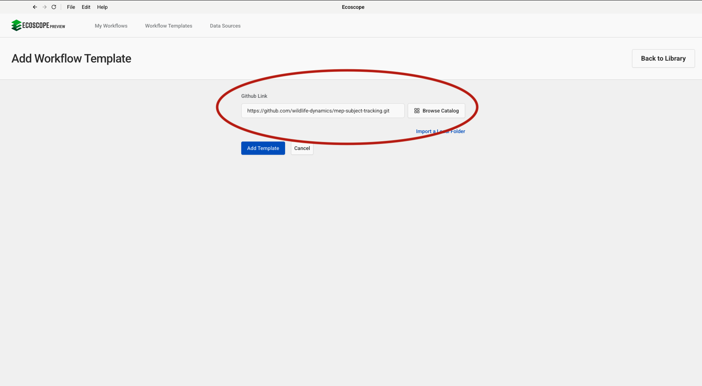
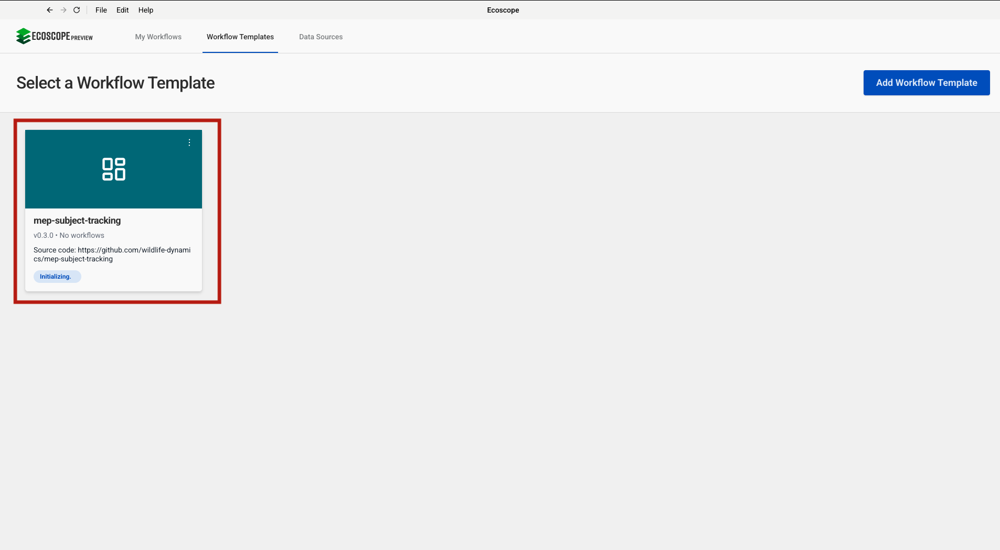
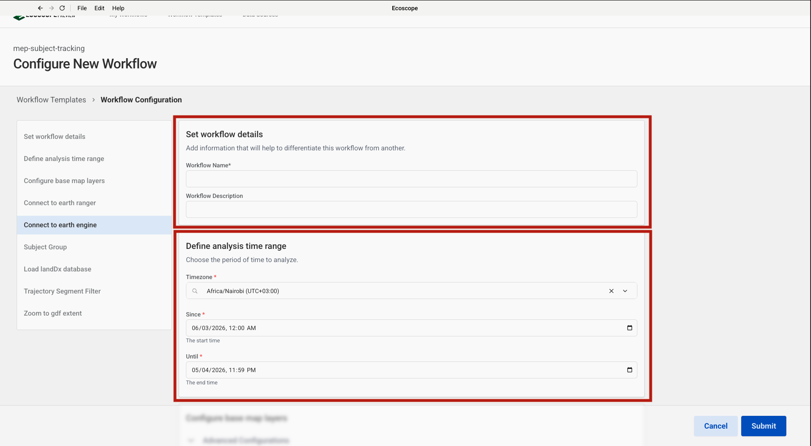
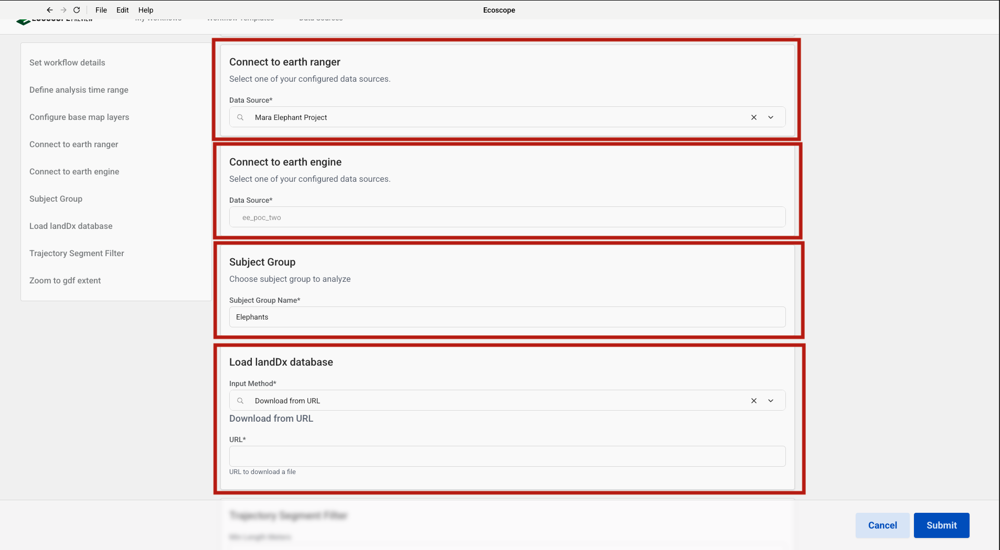
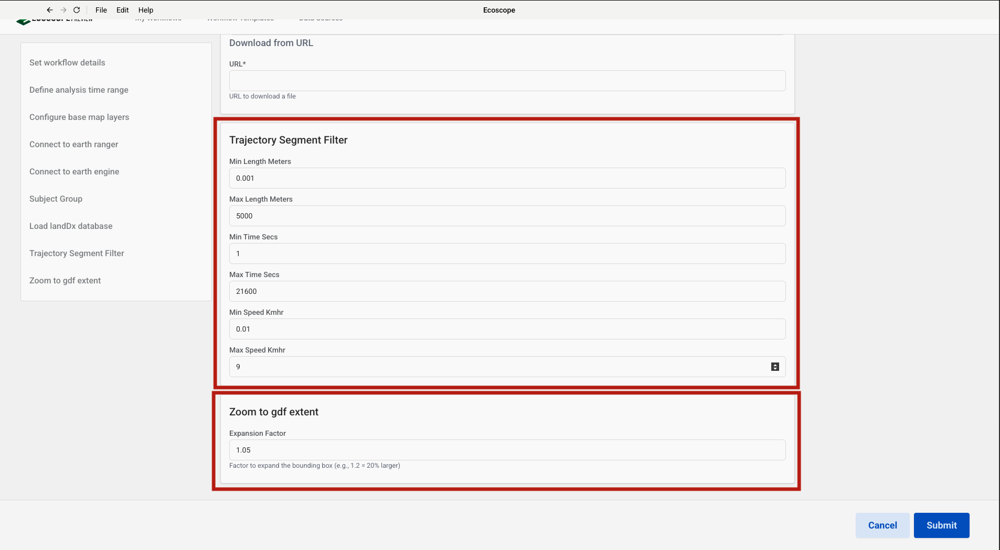

# MEP Subject Tracking — User Guide

This guide walks you through configuring and running the MEP Subject Tracking workflow, which ingests GPS telemetry from EarthRanger, derives movement ecology metrics via Google Earth Engine, and produces a comprehensive per-subject tracking report for collared wildlife in the Mara ecosystem.

---

## Overview

The workflow delivers, for each subject in the selected group:

- **3 maps** — speed map, ETD home range map, and seasonal home range map with MCP overlay
- **4 time-series plots** — Net Square Displacement (NSD), speed, collar event timeline, and MCP asymptote
- **10 dashboard metrics** — protected area use, agricultural land use, Kenya use, unprotected use, MCP area, ETD area, distance travelled, max displacement, and night/day ratio
- **4 CSV tables** — subject info, movement stats, occupancy, and seasonal windows
- A **Word mapbook** — cover page plus one fully populated section per subject

---

## Prerequisites

Before running the workflow, ensure you have:

- Access to an **EarthRanger** instance with subject group observations and MEP collar events logged for the analysis period
- Access to a **Google Earth Engine** service account with a private key in JSON format

---

## Step-by-Step Configuration

### Step 1 — Add the Workflow Template

In the workflow runner, go to **Workflow Templates** and click **Add Workflow Template**. Paste the GitHub repository URL into the **Github Link** field:

```
https://github.com/wildlife-dynamics/mep-subject-tracking.git
```

Then click **Add Template**.



---

### Step 2 — Configure Connection

Navigate to **Data Sources** and click **Connect**. A dialog will appear prompting you to **Select Data Source Type**. This workflow requires two connections:

| Data Source Type | Purpose |
|-----------------|---------|
| **EarthRanger** | Pull subject group observations, metadata, and MEP collar events |
| **Google Earth Engine** | Compute NDVI-based wet/dry seasonal windows per subject home range |

Select **EarthRanger** first and complete Step 3, then repeat and select **Google Earth Engine** for Step 4.


---

### Step 3 — Add an EarthRanger Connection

After selecting **EarthRanger** in Step 2, fill in the connection form:

- **Data Source Name** — a label to identify this connection
- **EarthRanger URL** — your instance URL (e.g. `your-site.pamdas.org`)
- **EarthRanger Username** and **EarthRanger Password**

> Credentials are not validated at setup time. Any authentication errors will appear when the workflow runs.

Click **Connect** to save.


---

### Step 4 — Add a Google Earth Engine Connection

After selecting **Google Earth Engine** in Step 2, fill in the connection form:

- **Data Source Name** — a label to identify this connection
- **Private Key** — click **Browse** to select your GEE service account private key file (JSON format)

> To generate a private key, follow the instructions in the [Setup Guide](https://developers.google.com/earth-engine/guides/service_account). The key is stored encrypted and used only to authenticate with Google Earth Engine.

Click **Connect** to save.


---

### Step 5 — Select the Workflow

After the template is added, it appears in the **Workflow Templates** list as **mep-subject-tracking**. Click it to open the workflow configuration form.

> The card may show **Initializing…** briefly while the environment is set up.



---

### Step 6 — Set Workflow Details and Analysis Time Range

The configuration form opens with two sections at the top.

**Set workflow details**

| Field | Description |
|-------|-------------|
| Workflow Name | A short name to identify this run |
| Workflow Description | Optional notes (e.g. subject group, site, or reporting period) |

**Define analysis time range**

| Field | Description |
|-------|-------------|
| Timezone | Select the local timezone (e.g. `Africa/Nairobi UTC+03:00`) |
| Since | Start date and time of the analysis period |
| Until | End date and time of the analysis period |

All GPS relocations, collar events, and GEE seasonal windows are fetched within this window.



---

### Step 7 — Connect to EarthRanger, Connect to Earth Engine, Set Subject Group, and Load LandDx Database

Scroll down to configure the next four sections.

**Connect to earth ranger**

Select the EarthRanger data source configured in Step 3 from the **Data Source** dropdown (e.g. `Mara Elephant Project`).

**Connect to earth engine**

Select the Google Earth Engine data source configured in Step 4 from the **Data Source** dropdown.

**Subject Group**

Enter the name of the EarthRanger subject group to analyse in the **Subject Group Name** field (default: `Elephants`). Each subject in the group will be processed individually.

**Load landDx database**

Choose how to provide the LandDx GeoPackage used for land-use occupancy analysis:

| Input Method | When to use |
|-------------|-------------|
| **Download from URL** | Use if you do not have a local copy — paste the Dropbox URL below |
| **Local path** | Use if you already have `landDx.gpkg` on the machine running the workflow |

If downloading, paste the following URL into the **URL** field:

```
https://www.dropbox.com/scl/fi/v9maw2jeg1zptv68qtpv3/landDx.gpkg?rlkey=kez5vsbxkgha2emfy5kzwa5n1&st=98v4anq3&dl=0
```



---

### Step 8 — Trajectory Segment Filter and Zoom to GDF Extent

Scroll down to configure the final two sections.

**Trajectory Segment Filter**

These thresholds control how raw GPS fixes are joined into trajectory segments. Segments that fall outside the limits are broken at that point, preventing implausible long-distance jumps from being included.

| Field | Default | Description |
|-------|---------|-------------|
| Min Length Meters | — | Minimum segment length to retain (leave blank to skip) |
| Max Length Meters | 5000 | Maximum segment length in metres |
| Min Time Secs | — | Minimum time between fixes (leave blank to skip) |
| Max Time Secs | 17340 | Maximum time between consecutive fixes in seconds (~4.8 hours) |
| Min Speed Kmhr | -0.01 | Minimum speed threshold (slightly negative to allow rounding errors) |
| Max Speed Kmhr | 9 | Maximum plausible speed in km/h |

**Zoom to gdf extent**

| Field | Default | Description |
|-------|---------|-------------|
| Expansion Factor | 1.25 | Factor to expand the bounding box around each subject's data extent (e.g. 1.25 = 25% padding) |

Once all parameters are set, click **Submit**.



---

## Running the Workflow

Once submitted, the runner will:

1. Load the LandDx database and create land-use styled map layers.
2. Fetch subject metadata and GPS observations from EarthRanger for the specified time range and subject group.
3. Fetch MEP collar events (`mep_collar_check`, `mep_collaring`, `mep_source_failure`).
4. Compute subject maturity (6-month threshold) and split all data by subject name.
5. Convert relocations to trajectories using the configured segment filter; classify speed into 6 bins.
6. Compute ETD home range and seasonal windows via Google Earth Engine per subject.
7. Generate speed map, home range map, and seasonal home range map per subject.
8. Generate NSD, speed, collar event, and MCP asymptote plots per subject.
9. Compute movement statistics and land-use occupancy per subject.
10. Download Word report templates from Dropbox and populate one section per subject.
11. Merge all sections with the cover page into a single Word mapbook.
12. Save all outputs to the directory specified by `ECOSCOPE_WORKFLOWS_RESULTS`.

---

## Output Files

All outputs are written to `$ECOSCOPE_WORKFLOWS_RESULTS/`. Files marked with `<subject>` are produced once per subject in the group.

| File | Description |
|------|-------------|
| `<subject>_speedmap.html` / `.png` | Speed map — path coloured by 6-bin speed classification |
| `<subject>_homerange.html` / `.png` | ETD home range map — percentile contours 50–99.9th |
| `<subject>_seasonal_home_range.html` / `.png` | Seasonal home range map with MCP outline overlay |
| `<subject>_nsd_seasonal_plot.html` / `.png` | Net Square Displacement time-series with season bands |
| `<subject>_speed_seasonal_plot.html` / `.png` | Speed time-series with season bands |
| `<subject>_collared_subject_plot.html` / `.png` | Collar event timeline plot |
| `<subject>_mcp_asymptote_plot.html` / `.png` | MCP area growth curve |
| `<subject>_subject_info.csv` | Subject metadata (name, sex, DOB, status, region, etc.) |
| `<subject>_subject_stats.csv` | Movement stats: MCP, ETD, distance, max displacement, night/day ratio |
| `<subject>_subject_occupancy.csv` | Land-use occupancy percentages by category |
| `<subject>_seasonal_windows.csv` | GEE-derived wet/dry season date windows |
| `<subject>_profile.png` | Subject profile photo from EarthRanger |
| `mep_context.docx` | Report cover page (subject count, report period) |
| `<merged_mapbook>.docx` | Final merged Word mapbook (cover + all subject sections) |
