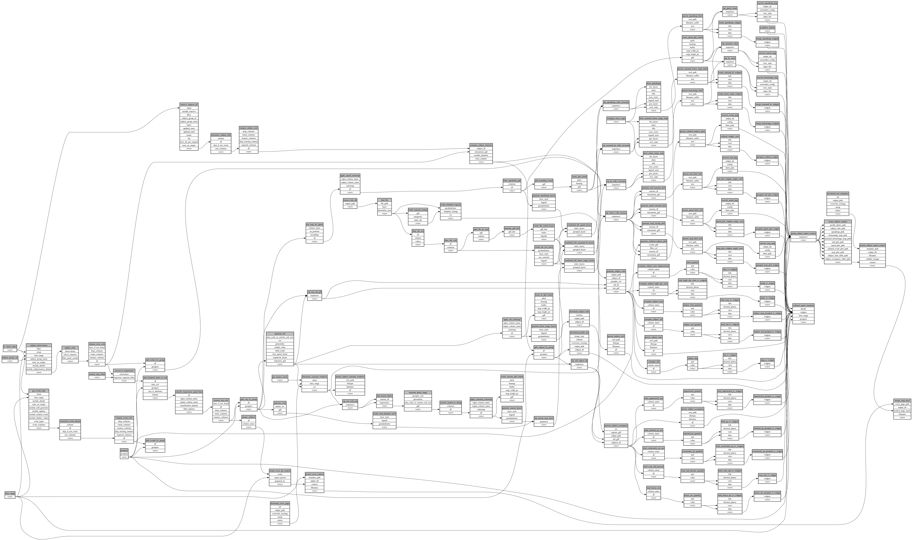

```
# AUTOGENERATED BY ECOSCOPE-WORKFLOWS; see fingerprint in README.md for details

```

```yaml
# fingerprint:
artifacts_sha256_basic: 860dcd5f6703be77762f375e80a9ea02b0143a2b6ac5c35c352aa1e70e068b39
artifacts_sha256_strict: b28bb9da632561df1a56a605c97b13f4175261b3f27c84840803a268a43a0cff
installed_requirements:
- channel: https://repo.prefix.dev/ecoscope-workflows/
  name: ecoscope-workflows-core
  version: {version: ==0.22.9}
- channel: https://repo.prefix.dev/ecoscope-workflows/
  name: ecoscope-workflows-ext-ecoscope
  version: {version: ==0.22.9}
- channel: https://repo.prefix.dev/ecoscope-workflows-custom/
  name: ecoscope-workflows-ext-custom
  version: {version: ==0.0.28}
- channel: https://repo.prefix.dev/ecoscope-workflows-custom/
  name: ecoscope-workflows-ext-ste
  version: {version: ==0.0.16}
- channel: https://repo.prefix.dev/ecoscope-workflows-custom/
  name: ecoscope-workflows-ext-mnc
  version: {version: ==0.0.7}
- channel: https://repo.prefix.dev/ecoscope-workflows-custom/
  name: ecoscope-workflows-ext-mep
  version: {version: ==0.0.8}
params_sha256: f911408ed16a7d281a721f6440ab1d8fd0347738a570da12ad1bf9c5a0f5d23e
spec_sha256: 41e8169544339b8abb6c3b60c36d8a3100b0221a6fc153c918335ced0060172f

```

# ecoscope-workflows-individual-subject-tracking-report-workflow


