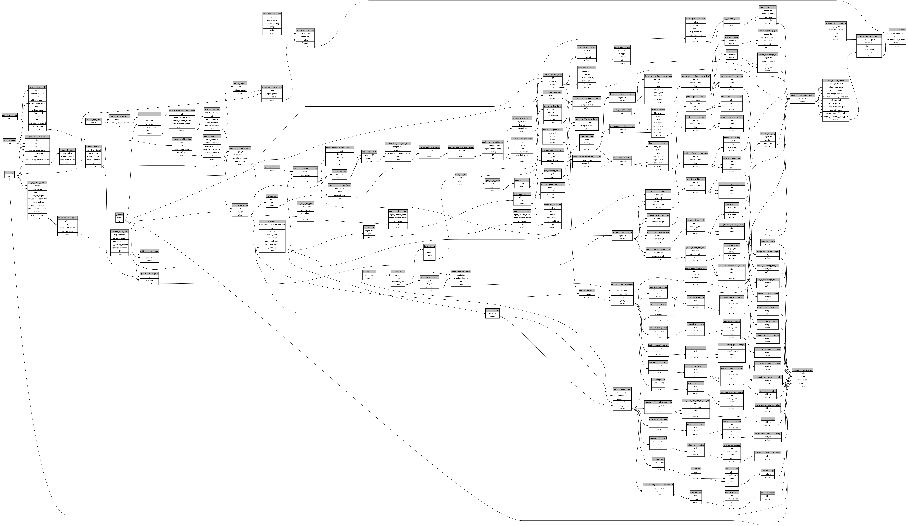

```
# AUTOGENERATED BY ECOSCOPE-WORKFLOWS; see fingerprint in README.md for details

```

```yaml
# fingerprint:
artifacts_sha256_basic: c05debf16293676a946118e546c5259038bf3866c19ba33ca7d4b2cb2caebb76
artifacts_sha256_strict: 3982c91d4dd61474be463d35cd8ca922b7c04ef3ccffaa54448b9b93273f6b47
installed_requirements:
- channel: https://repo.prefix.dev/ecoscope-workflows/
  name: ecoscope-workflows-core
  version: {version: ==0.22.9}
- channel: https://repo.prefix.dev/ecoscope-workflows/
  name: ecoscope-workflows-ext-ecoscope
  version: {version: ==0.22.9}
- channel: https://repo.prefix.dev/ecoscope-workflows-custom/
  name: ecoscope-workflows-ext-custom
  version: {version: ==0.0.28}
- channel: https://repo.prefix.dev/ecoscope-workflows-custom/
  name: ecoscope-workflows-ext-ste
  version: {version: ==0.0.16}
- channel: https://repo.prefix.dev/ecoscope-workflows-custom/
  name: ecoscope-workflows-ext-mnc
  version: {version: ==0.0.7}
- channel: https://repo.prefix.dev/ecoscope-workflows-custom/
  name: ecoscope-workflows-ext-mep
  version: {version: ==0.12.0}
params_sha256: f911408ed16a7d281a721f6440ab1d8fd0347738a570da12ad1bf9c5a0f5d23e
spec_sha256: 1528b4a71dbdbec51fad55497772dacb8a8e197bd016b2cda7a9a1f898c54505

```

# ecoscope-workflows-subject-tracking-workflow


